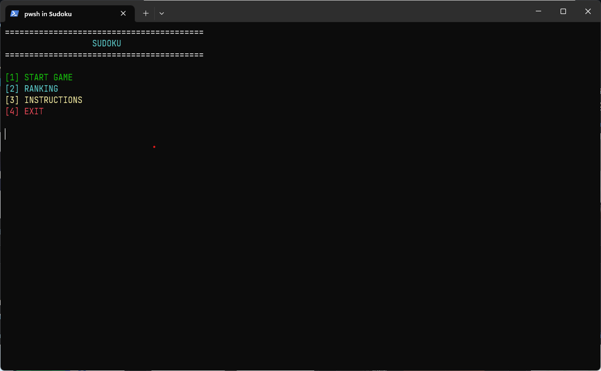
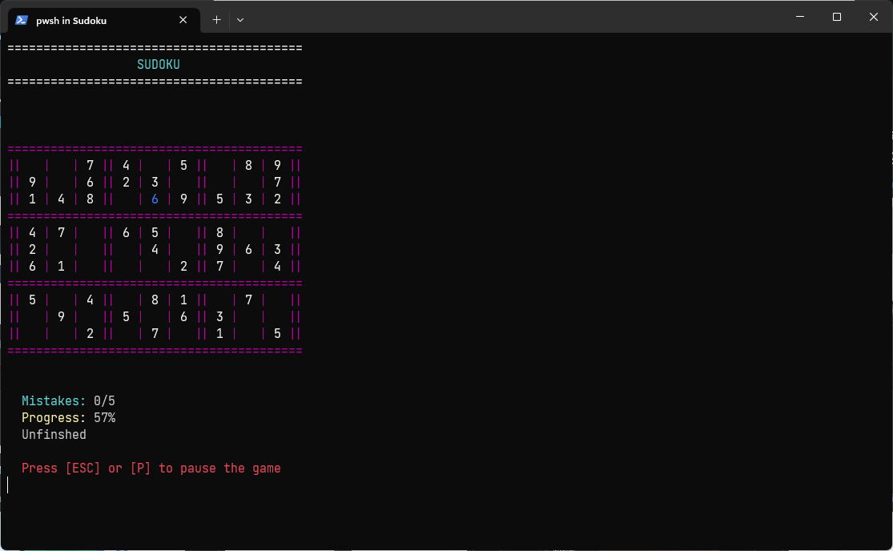

# Sudoku

## What is Sudoku?
 
 + Sudoku is one of the most popular puzzle games of all time. The goal of Sudoku is to fill in the numbers in a 9x9 grid so that each row, each column and each 3x3 grid section contains all the numbers from 1 to 9. 
 + Like a logic puzzle, Sudoku also is a great brain game. If you play Sudoku every day, you will soon start to see improvements in your concentration and overall brain power.

## Screenshots
+ Menu



+ StartGame



## Install

+ I use template project cpp. You can refer to [Here](https://github.com/Dominic-github/CppProject)

+ Clone my project

```
    git clone https://github.com/Farawayx/Sudoku
```

